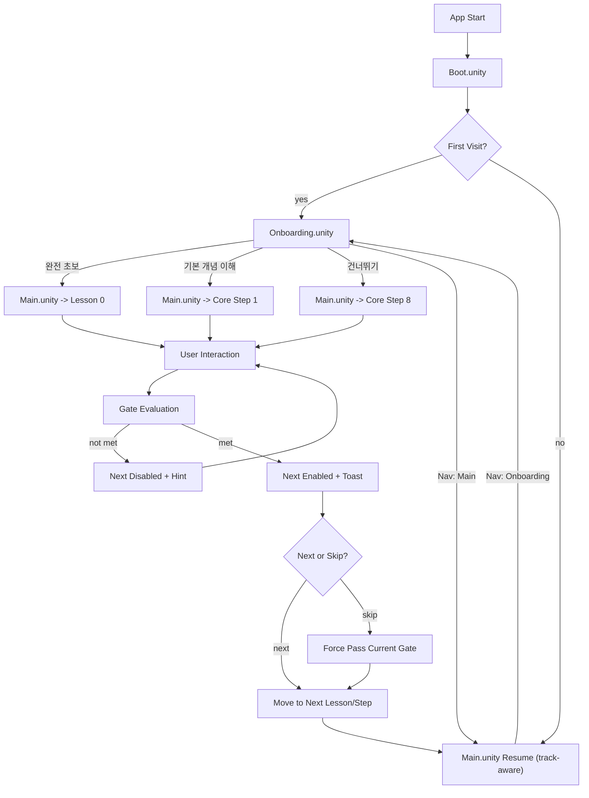

# KineTutor3D User Flow

Version: 1.4.0
Last Updated: 2026-03-11 (KST)

## 목표
- 초보 학습자가 수학 이전의 직관 lesson을 거쳐 8단계 코어 튜토리얼까지 압도감 없이 완료한다.
- `Hard gate + Skip` 정책으로 학습 집중과 이탈 방지를 동시에 달성한다.

## Current Runtime vs Product Target
- 현재 런타임 baseline은 `Boot -> Onboarding -> Main` 학습 흐름이다.
- 제품 문서 기준의 확장 타깃은 `Onboarding -> Home -> Guided Lesson / Sandbox / Challenge / Progress / Settings` 구조다.
- 본 문서는 현재 런타임 규칙을 유지하면서도 future product target을 병행 추적한다.

## End-to-End Flow (Scene Split)
1. 앱 시작
2. `Boot.unity`에서 첫 방문 여부 확인
3. 분기
   - 첫 방문: `Onboarding.unity`
   - 재방문: `Main.unity`
4. `Onboarding.unity`
   - `완전 초보`: 방문 기록 저장 후 `Main.unity` -> `Lesson 0`
   - `기본 개념은 알고 있음`: 방문 기록 저장 후 `Main.unity` -> `Core Track Step 1`
   - 건너뛰기: 방문 기록 저장 후 `Main.unity` -> `Core Track Step 8`
   - 상단 네비게이션으로 `Main` 이동 가능
5. `Main.unity`
   - `Pre-Kinematics Track`: trail, target, why-it-moved 중심 입력
   - `Core Track`: Step 진행 중 입력(호버/클릭/슬라이더)
   - Slider: `theta` 단일 소스(deg 입력 -> rad 변환)
   - DH Table: `d/a/alpha`만 편집 가능(`theta` read-only)
6. Gate 조건 평가
   - 미충족: Next 비활성, 힌트/토스트 안내
   - 충족: Next 활성, 완료 토스트 표시
7. Step 전환 시 패널/포커스/툴팁 상태 동기화
8. 재방문 시 `Boot -> Main`으로 바로 복귀하고 `pre_kinematics_resume` 또는 `core_kinematics_resume`에서 시작

## Flow Diagram

## 상태 전이
- Session: `init -> boot -> onboarding|main -> learning -> completed`
- Track: `pre_kinematics | core_kinematics`
- Lesson/Step: `lesson_0 ... lesson_3`, `step_1 ... step_8`
- Gate: `locked -> unlocked`

## Product Target Navigation
1. `Onboarding`은 계속 첫 방문 진입점으로 유지한다.
2. 재방문 기본 진입점은 향후 `Main`에서 `Home`으로 이동한다.
3. `Home`은 `Guided Lesson`, `Sandbox`, `Challenge`, `Progress`, `Settings` 진입 허브가 된다.
4. 현재 `Step 8` 기반 자유 실습은 향후 별도 `Sandbox` 화면으로 승격한다.
5. future product target의 `Guided Lesson`은 `완전 초보 -> Pre-Kinematics Lesson 0~3 -> Core Track Step 1~8` 구조를 기본 경로로 가진다.

## UX 게이트 규칙
1. 기본 정책: `Hard gate` (조건 충족 전 Next 비활성)
2. 예외 정책: `Skip` 버튼 허용 (현재 Step 강제 통과)
3. 검증 실패 입력(예: NaN/Infinity)은 계산 파이프라인 진입 금지
4. `Lesson 0~3`에서는 행렬/공식 대신 `trail`, `target marker`, `reach/not reach`, `Why It Moved`를 우선한다.

## 수용 기준
1. 첫 방문은 `Boot -> Onboarding`, 재방문은 `Boot -> Main`으로 분기된다.
2. Onboarding 이후 `완전 초보 -> Lesson 0`, `기본 개념 이해자 -> Core Track Step 1` 분기가 존재한다.
3. Gate 완료 전 Next 비활성, 완료 후 활성으로 정확히 전환된다.
4. Skip 사용 시 현재 Lesson/Step을 건너뛰고 다음 단계로 정상 진입한다.
5. MatrixDisplay가 `Core Track`에서 `A1/A2/T02`를 이벤트 기반으로 실시간 갱신한다.
6. `Lesson 0~3` 문서 어디에도 sin/cos 공식, 삼각형 유도, Jacobian, DH 표가 핵심 화면으로 요구되지 않는다.
7. future product target 기준으로 `Home / Sandbox / Challenge` 확장 방향이 `WIREFRAME.md`와 충돌하지 않는다.
