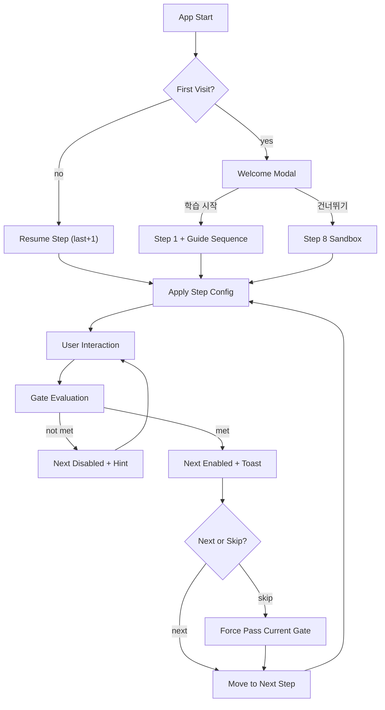

# KineTutor3D User Flow

Version: 1.1.0
Last Updated: 2026-03-05 (KST)

## 목표
- 초보 학습자가 8단계 튜토리얼을 압도감 없이 완료한다.
- `Hard gate + Skip` 정책으로 학습 집중과 이탈 방지를 동시에 달성한다.

## End-to-End Flow (Onboarding 포함)
1. 앱 시작
2. 첫 방문이면 환영 모달 표시
3. 분기
   - 학습 시작: Step 1 + 가이드 시퀀스 자동 재생
   - 건너뛰기: Step 8 샌드박스 진입
4. Step 진행 중 입력(호버/클릭/슬라이더)
5. Gate 조건 평가
   - 미충족: Next 비활성, 힌트/토스트 안내
   - 충족: Next 활성, 완료 토스트 표시
6. Step 전환 시 패널/포커스/툴팁 상태 동기화
7. 재방문 시 마지막 완료 Step+1로 복귀

## Flow Diagram

## 상태 전이
- Session: `init -> onboarding|resume -> learning -> completed`
- Step: `step_1 ... step_8`
- Gate: `locked -> unlocked`

## UX 게이트 규칙
1. 기본 정책: `Hard gate` (조건 충족 전 Next 비활성)
2. 예외 정책: `Skip` 버튼 허용 (현재 Step 강제 통과)
3. 검증 실패 입력(예: NaN/Infinity)은 계산 파이프라인 진입 금지

## 수용 기준
1. Step별 패널 상태가 `TutorStepConfig`와 100% 일치한다.
2. 첫 방문 온보딩과 재방문 복귀가 분기대로 동작한다.
3. Gate 완료 전 Next 비활성, 완료 후 활성으로 정확히 전환된다.
4. Skip 사용 시 현재 Step을 건너뛰고 다음 Step으로 정상 진입한다.
