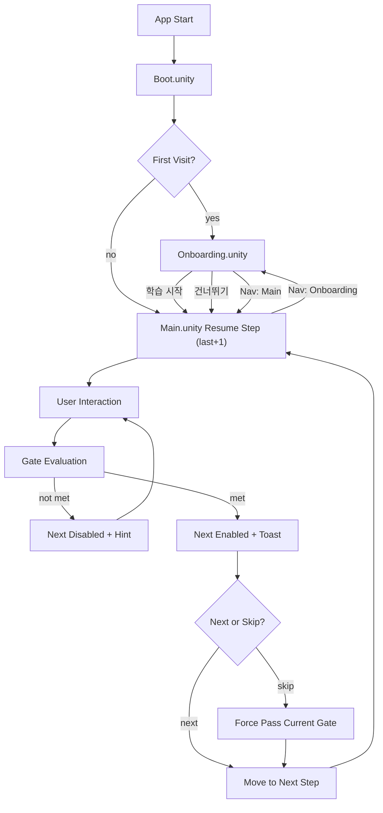

# KineTutor3D User Flow

Version: 1.2.0
Last Updated: 2026-03-09 (KST)

## 목표
- 초보 학습자가 8단계 튜토리얼을 압도감 없이 완료한다.
- `Hard gate + Skip` 정책으로 학습 집중과 이탈 방지를 동시에 달성한다.

## End-to-End Flow (Scene Split)
1. 앱 시작
2. `Boot.unity`에서 첫 방문 여부 확인
3. 분기
   - 첫 방문: `Onboarding.unity`
   - 재방문: `Main.unity`
4. `Onboarding.unity`
   - 학습 시작: 방문 기록 저장 후 `Main.unity`
   - 건너뛰기: 방문 기록 저장 후 `Main.unity`
   - 상단 네비게이션으로 `Main` 이동 가능
5. `Main.unity`
   - Step 진행 중 입력(호버/클릭/슬라이더)
   - Slider: `theta` 단일 소스(deg 입력 -> rad 변환)
   - DH Table: `d/a/alpha`만 편집 가능(`theta` read-only)
6. Gate 조건 평가
   - 미충족: Next 비활성, 힌트/토스트 안내
   - 충족: Next 활성, 완료 토스트 표시
7. Step 전환 시 패널/포커스/툴팁 상태 동기화
8. 재방문 시 `Boot -> Main`으로 바로 복귀하고 마지막 완료 Step+1에서 시작

## Flow Diagram

## 상태 전이
- Session: `init -> boot -> onboarding|main -> learning -> completed`
- Step: `step_1 ... step_8`
- Gate: `locked -> unlocked`

## UX 게이트 규칙
1. 기본 정책: `Hard gate` (조건 충족 전 Next 비활성)
2. 예외 정책: `Skip` 버튼 허용 (현재 Step 강제 통과)
3. 검증 실패 입력(예: NaN/Infinity)은 계산 파이프라인 진입 금지

## 수용 기준
1. Step별 패널 상태가 `TutorStepConfig`와 100% 일치한다.
2. 첫 방문은 `Boot -> Onboarding`, 재방문은 `Boot -> Main`으로 분기된다.
3. Gate 완료 전 Next 비활성, 완료 후 활성으로 정확히 전환된다.
4. Skip 사용 시 현재 Step을 건너뛰고 다음 Step으로 정상 진입한다.
5. MatrixDisplay가 `A1/A2/T02`를 이벤트 기반으로 실시간 갱신한다.
