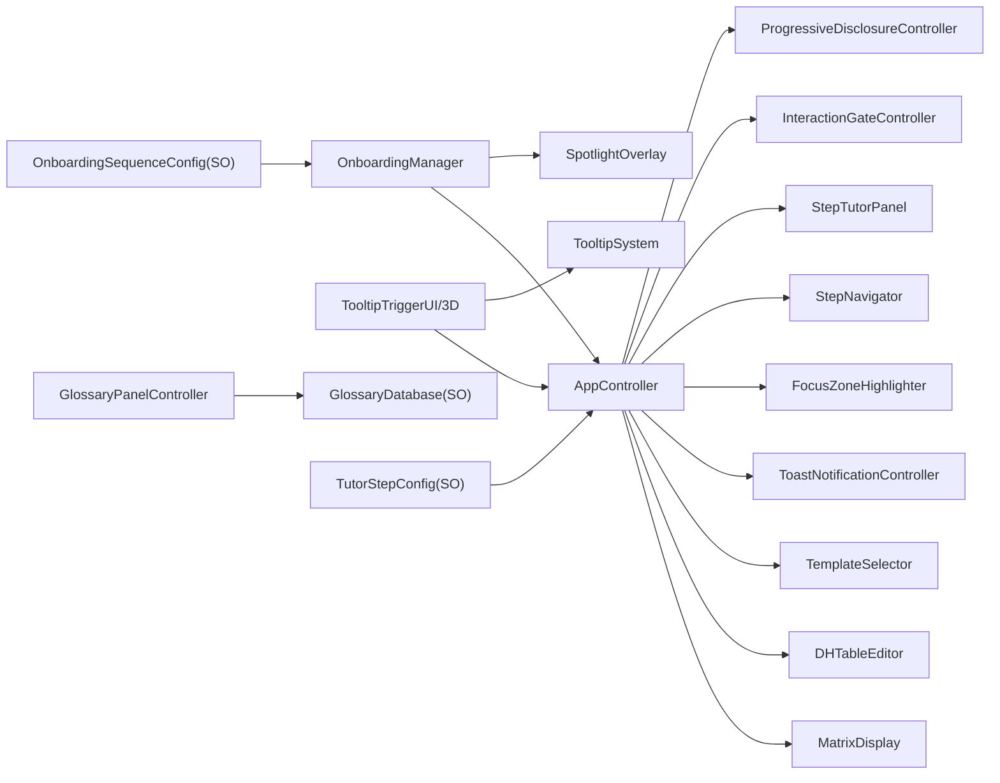
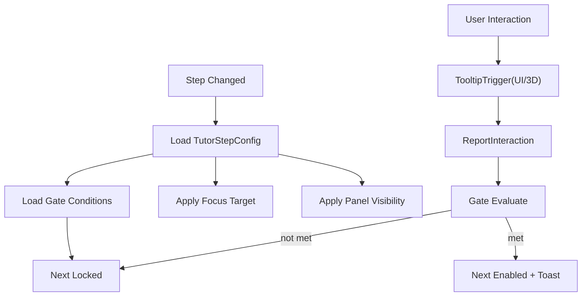
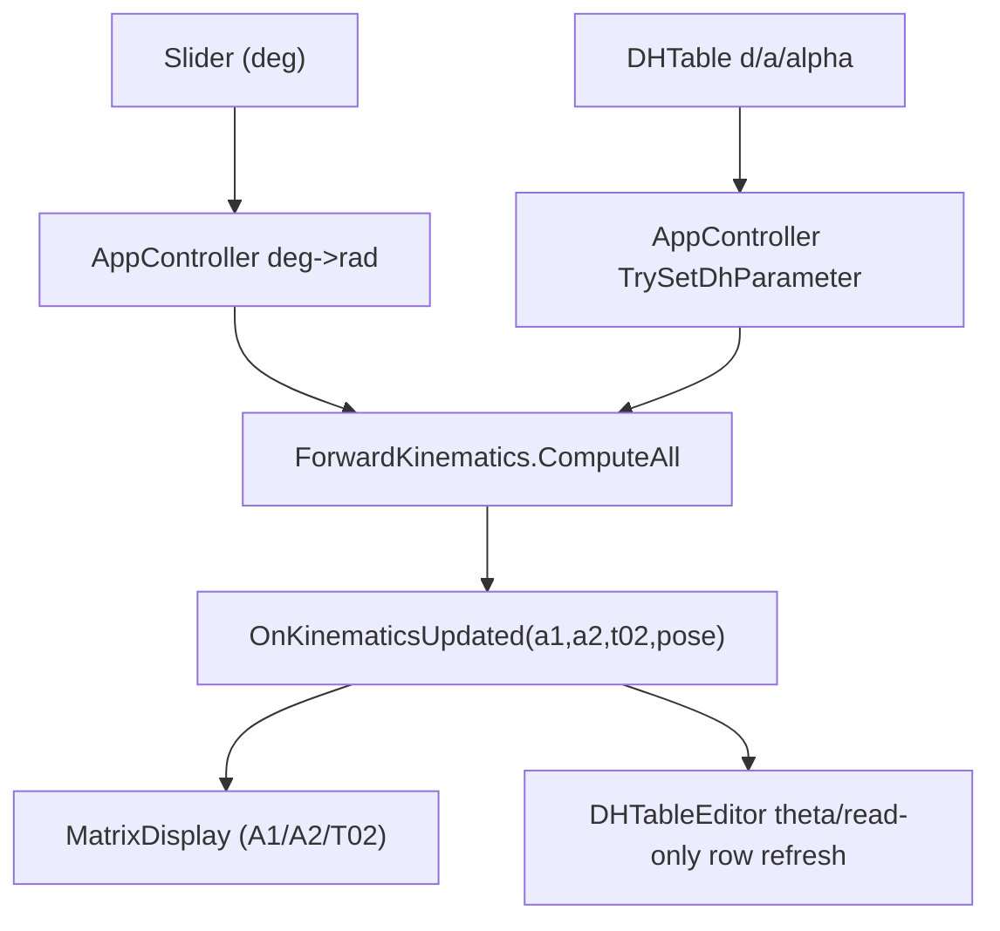
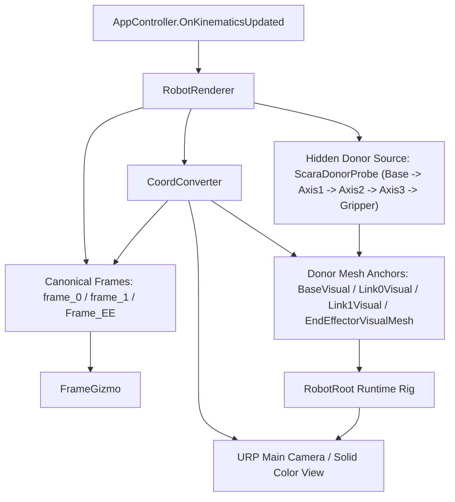
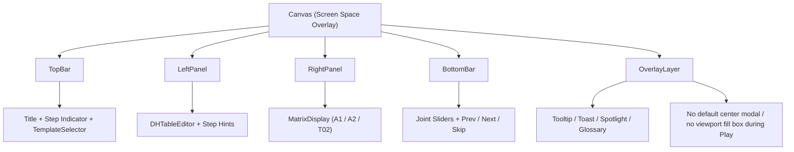

# KineTutor3D Architecture Diagrams

Version: 1.4.0
Last Updated: 2026-03-09 (KST)

## UX Module Map (Phase 3 확장)

## Step Runtime Data Flow

## FK Runtime Data Flow (Phase 3 MVP+)

## Visualization Runtime Data Flow (Phase 4 Core)

## Scene UI Layout (MVP)

## 신규 런타임 컴포넌트
1. ProgressiveDisclosureController
2. OnboardingManager
3. TooltipSystem
4. TooltipTriggerUI
5. TooltipTrigger3D
6. SliderGateReporter
7. InteractionGateController
8. ToastNotificationController
9. GlossaryPanelController
10. SpotlightOverlay
11. FocusZoneHighlighter
12. StepProgressSaver
13. DHTableEditor
14. TemplateSelector
15. MatrixDisplay
16. CoordConverter
17. FrameGizmo
18. RobotRenderer

## 설계 규칙
1. 기구학 계산 로직은 UX 컴포넌트에 두지 않는다.
2. Step 상태 결정은 `TutorStepConfig` 기반으로만 수행한다.
3. Gate 판정은 `InteractionGateController` 단일 책임으로 유지한다.
4. 런타임 진행 상태 저장은 `StepProgressSaver`만 사용한다.
5. Visualization의 frame ownership은 `frame_0`, `frame_1`, `Frame_EE`가 단일 source다.
6. `realvirtual` 자산은 donor mesh source로만 사용하고 vendor runtime은 사용하지 않는다.
7. UI는 `TopBar`, `LeftPanel`, `RightPanel`, `BottomBar` 4영역을 기준으로 정리하고 디버그성 임시 흰 패널을 제품 surface로 남기지 않는다.
8. Phase 4 렌더 기준은 URP + Solid Color camera이며 donor mesh는 에러 셰이더 상태를 허용하지 않는다.
9. Play 중 중앙을 덮는 placeholder modal과 viewport fill box는 허용하지 않는다.
10. 온보딩은 유효한 모달 구성이 있는 경우에만 표시하며, placeholder만 존재하면 즉시 스텝 흐름으로 진행한다.
