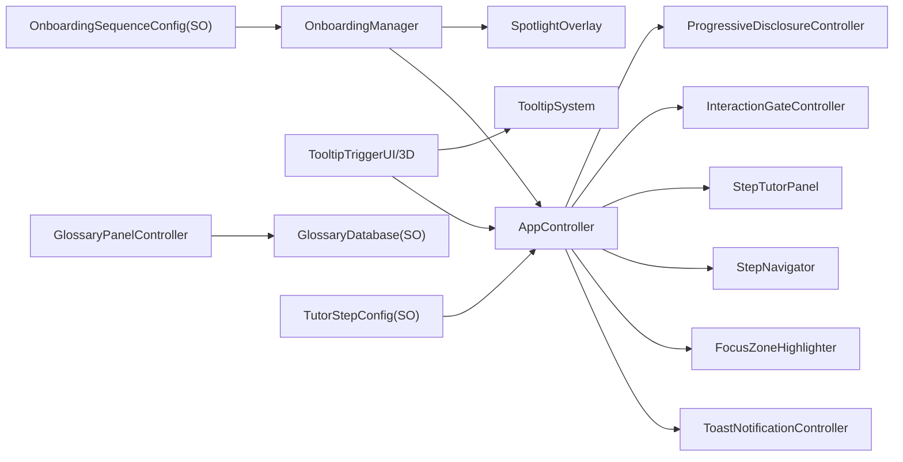
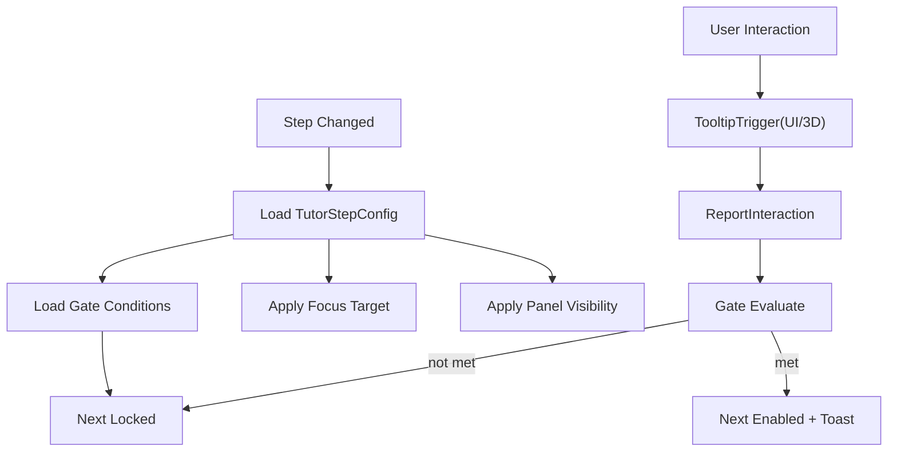

# KineTutor3D Architecture Diagrams

Version: 1.1.0
Last Updated: 2026-03-05 (KST)

## UX Module Map (Phase 3 확장)

## Step Runtime Data Flow

## 신규 런타임 컴포넌트
1. ProgressiveDisclosureController
2. OnboardingManager
3. TooltipSystem
4. TooltipTriggerUI
5. TooltipTrigger3D
6. SliderGateReporter
7. InteractionGateController
8. ToastNotificationController
9. GlossaryPanelController
10. SpotlightOverlay
11. FocusZoneHighlighter
12. StepProgressSaver

## 설계 규칙
1. 기구학 계산 로직은 UX 컴포넌트에 두지 않는다.
2. Step 상태 결정은 `TutorStepConfig` 기반으로만 수행한다.
3. Gate 판정은 `InteractionGateController` 단일 책임으로 유지한다.
4. 런타임 진행 상태 저장은 `StepProgressSaver`만 사용한다.
