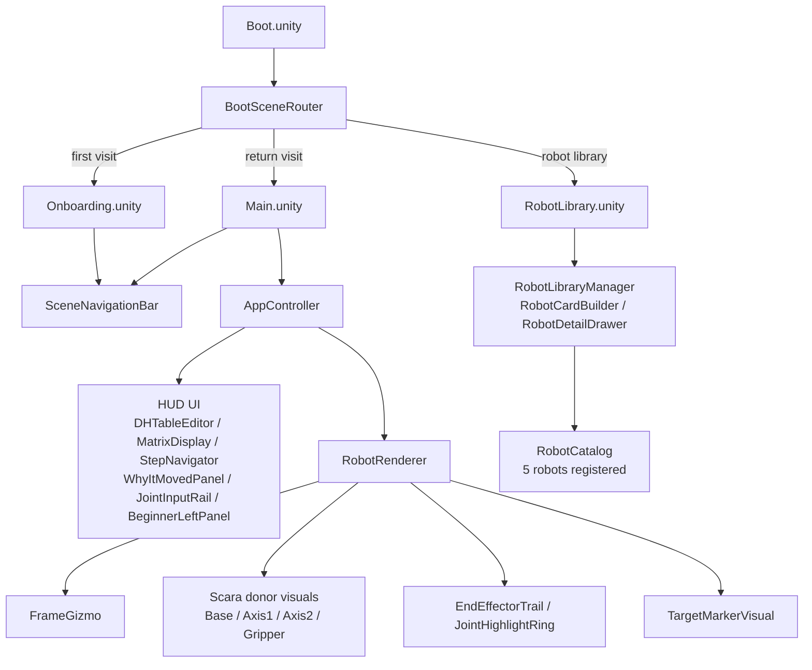
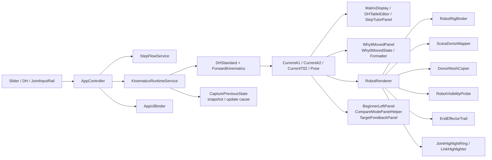
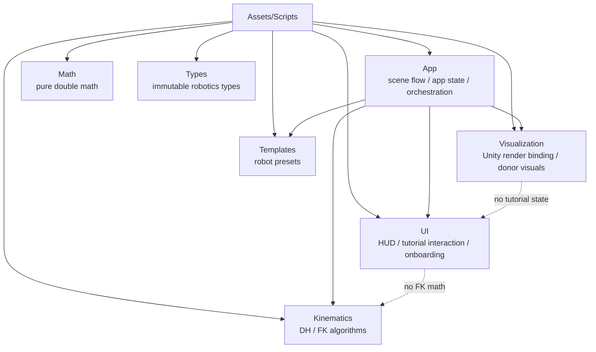

# KineTutor3D Architecture Mermaid

This is the fastest whole-system context document for new sessions.
Read this after `AGENTS.md` and before drilling into individual runtime files.

## 1. System Overview

## 2. Runtime Data Flow

## 3. Folder Responsibility Map

## 4. Stable Invariants
- `frame_0`, `frame_1`, and `Frame_EE` are the canonical frame ownership points.
- `ScaraRobot.prefab` is the donor source; visual donor path uses `Base`, `Axis1`, `Axis2`, and `Axis3/Gripper`.
- `Pick` is a helper point, not a visual donor.
- `AppController` is the public runtime state and event facade.
- `RobotRenderer` is the public visualization facade.
- `Math`, `Types`, and `Kinematics` stay pure C# `double`-based domain code.
- Build Settings: `Boot`(0), `Onboarding`(1), `Main`(2), `RobotLibrary`(3).
- `KinematicsRuntimeState` holds previous/current snapshots and `RuntimeUpdateCause`.
- `RobotCatalog` (Templates) is the single registry for all robot metadata + template factories.
- `RobotSelectionBridge` (App) passes robot selection between scenes via PlayerPrefs.
- Phase 5 complete: 76 source files, EditMode 107/107, PlayMode 30/30.
