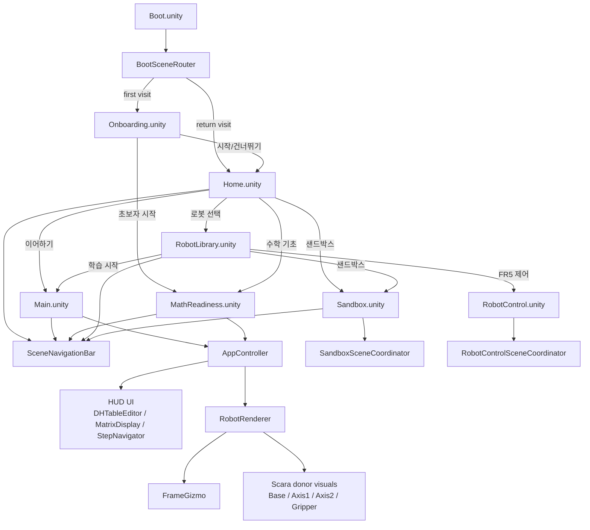
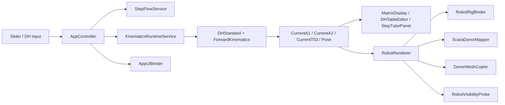
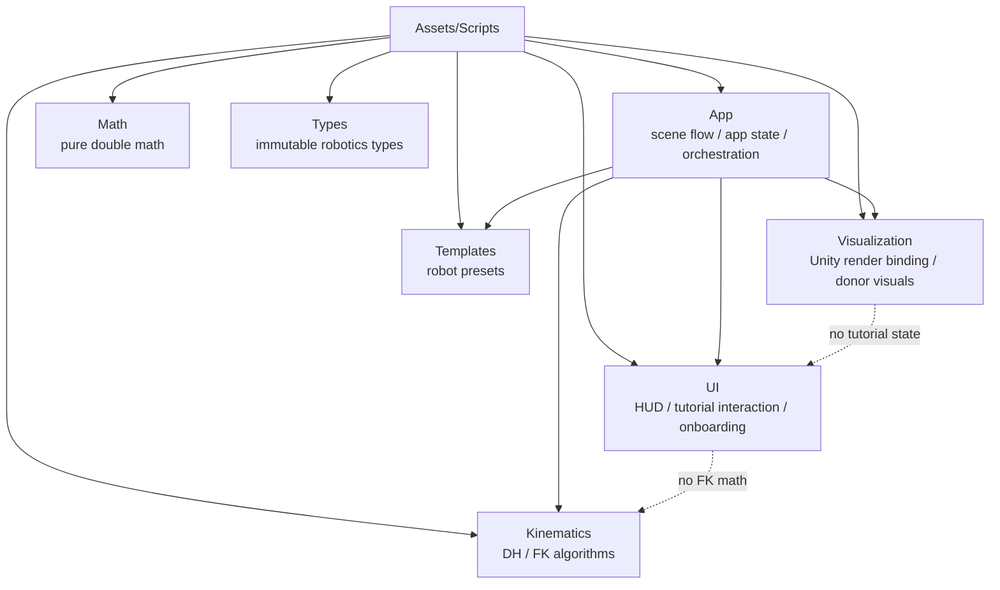

# KineTutor3D Architecture Mermaid

This is the fastest whole-system context document for new sessions.
Read this after `AGENTS.md` and before drilling into individual runtime files.

## 1. System Overview

## 2. Runtime Data Flow

## 3. Folder Responsibility Map

## 4. Scene Build Settings (index → scene)

| Index | Scene | 역할 |
|-------|-------|------|
| 0 | Boot | 라우터 전용 (첫 방문 판단) |
| 1 | Onboarding | 환영 모달, 초보자/기본 분기 |
| 2 | Home | 재진입 허브 (Continue Hub) |
| 3 | Main | Guided Lesson + 로봇/HUD |
| 4 | RobotLibrary | 로봇 카탈로그 + 3D showroom |
| 5 | Sandbox | 자유 실험 |
| 6 | RobotControl | FR5 실기 제어 콘솔 |
| 7 | MathReadiness | 수학 기초 워밍업 |

## 5. Stable Invariants
- `frame_0`, `frame_1`, and `Frame_EE` are the canonical frame ownership points.
- `ScaraRobot.prefab` is the donor source; visual donor path uses `Base`, `Axis1`, `Axis2`, and `Axis3/Gripper`.
- `Pick` is a helper point, not a visual donor.
- `AppController` is the public runtime state and event facade.
- `RobotRenderer` is the public visualization facade.
- `Math`, `Types`, and `Kinematics` stay pure C# `double`-based domain code.
- Scene cameras are managed by `SceneCameraDirector` (except RobotLibrary showroom).
- `IVisibilityControllable.SetVisible(bool)` is the standard panel visibility contract.
